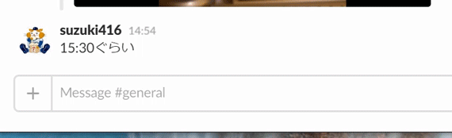

OverReaction
===

Reaction bot for slack

# Features
- Slack webhook
- Reaction portal
    - Manage words and reactions

# Setup
- [Setup(日本語)](document/setup_ja.md)
- [Setup(English)](document/setup_en.md) Under Construction...

# Contributing
1. Fork it!
1. Create your feature branch: `git checkout -b my-new-feature`
1. Commit your changes: `git commit -am 'Add some feature'`
1. Push to the branch: `git push origin my-new-feature`
1. Submit a pull request :D

# License
- MIT License.  
- Emoji used from [https://github.com/WebpageFX/emoji-cheat-sheet.com](https://github.com/WebpageFX/emoji-cheat-sheet.com)
