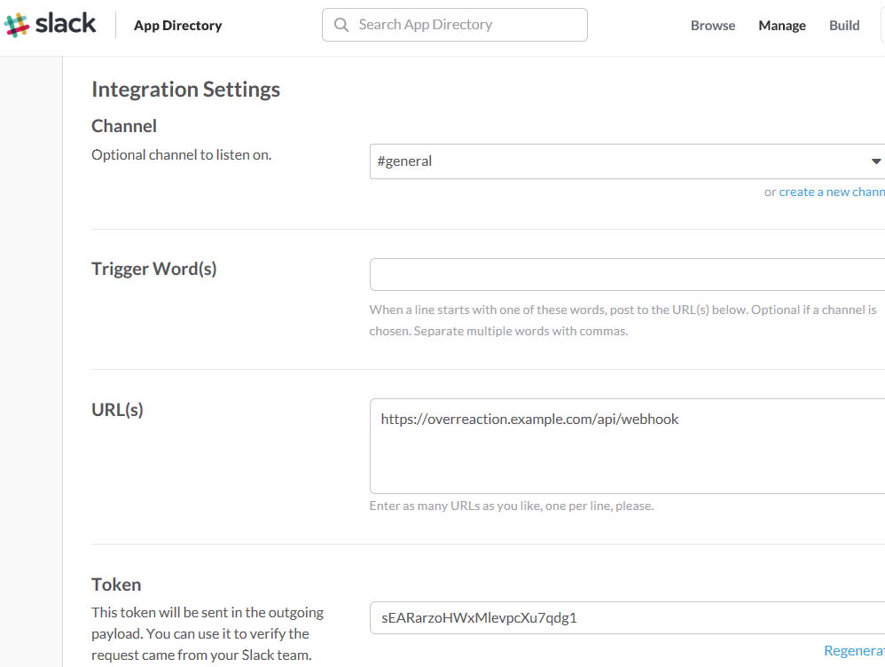

Setup
---

# Introduction
OverReaction is a Bot server for Slack. It uses Slack's outgoing webhooks, please execute OverReaction on the web server that can be accessed from Slack.

# Setup
## Slack
### Generate API Token(Quick)
1. Go to [https://api.slack.com/docs/oauth-test-tokens](https://api.slack.com/docs/oauth-test-tokens)
1. Generate Token of team using OverReaction. Please keep this token.

This token can control all of Slack. You generate token that can only add Slack reaction if possible.

### Webhook
1. Go to https://[team-name].slack.com/apps
1. Search the 'outgoing webhooks'.
1. Press the 'Add Configuration' button.
1. Select a channel. (Ex: #general)
1. __Caution!__ You should NOT set 'Trigger Word'. If you set text, only that text will be sent from Slack.
1. In the URL, set the address of OverReaction's Webhook API. (Ex: https://overreaction.example.com/api/webhook)
1. Token is used to verify whether OverReaction is access from Slack. Please keep.

## OverReaction
1. Download the OverReaction source.
1. Open `src/OverReaction/appsettings.json`.
1. Enter Tokens of XoxpToken and WebhookToken in `AppSetting`.
1. Install [.NET Core](https://www.microsoft.com/net/download/core#/current).
1. execute the following command in source folder.  
Windows  
`cd src\OverReaction & dotnet restore & dotnet run`  
Mac or Linux  
`cd src/OverReaction && dotnet restore && dotnet run`

## Try
1. Open the OverReaction web, press the '(+)' icon to add Word and Emoji.
1. Send text containing Word in Slack.
1. If the reaction set by Slack is added, it is done!

